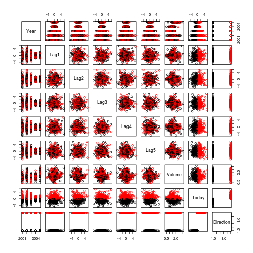

Introduction to Classification with the ISLR Library
========================================================

One of the biggest virtues of the Statistical Learning approach is tight intuitive integration of regression and classification.  To some extent, this has always been partially the case in standard econometric instruction given the prevalence of logit and probit modeling.  To my mind, however, these models were offered as ways to deal with categorical data, but beyond the linear form no strong fundamental connection was pursued *in my experience*.  In the Statistical Learning approach, heavy emphasis is made on the idea that we are always trying to estimate parameters based upon what is going on in the local neighborhood of the observation.  From this basis, regression and classification are natural extensions.

This script will work through some examples of the latter.


```r
library(ISLR)
```


For this task we will employ a dataset called **`Smarket`**.


```r
# View variable names
names(Smarket)
```

```
## [1] "Year"      "Lag1"      "Lag2"      "Lag3"      "Lag4"      "Lag5"     
## [7] "Volume"    "Today"     "Direction"
```

```r
# View data summary
summary(Smarket)
```

```
##       Year           Lag1             Lag2             Lag3       
##  Min.   :2001   Min.   :-4.922   Min.   :-4.922   Min.   :-4.922  
##  1st Qu.:2002   1st Qu.:-0.640   1st Qu.:-0.640   1st Qu.:-0.640  
##  Median :2003   Median : 0.039   Median : 0.039   Median : 0.038  
##  Mean   :2003   Mean   : 0.004   Mean   : 0.004   Mean   : 0.002  
##  3rd Qu.:2004   3rd Qu.: 0.597   3rd Qu.: 0.597   3rd Qu.: 0.597  
##  Max.   :2005   Max.   : 5.733   Max.   : 5.733   Max.   : 5.733  
##       Lag4             Lag5            Volume          Today       
##  Min.   :-4.922   Min.   :-4.922   Min.   :0.356   Min.   :-4.922  
##  1st Qu.:-0.640   1st Qu.:-0.640   1st Qu.:1.257   1st Qu.:-0.640  
##  Median : 0.038   Median : 0.038   Median :1.423   Median : 0.038  
##  Mean   : 0.002   Mean   : 0.006   Mean   :1.478   Mean   : 0.003  
##  3rd Qu.: 0.597   3rd Qu.: 0.597   3rd Qu.:1.642   3rd Qu.: 0.597  
##  Max.   : 5.733   Max.   : 5.733   Max.   :3.152   Max.   : 5.733  
##  Direction 
##  Down:602  
##  Up  :648  
##            
##            
##            
## 
```

```r
# View correlation matrix
pairs(Smarket, col = Smarket$Direction)
```

 


Looks like these variables are fairly uncorrelated.  Let's examine our first model.


```r
# Fit a logistic regression model (indicated by family=binomial)
glm.fit = glm(Direction ~ Lag1 + Lag2 + Lag3 + Lag4 + Lag5 + Volume, data = Smarket, 
    family = binomial)
# View model summary
summary(glm.fit)
```

```
## 
## Call:
## glm(formula = Direction ~ Lag1 + Lag2 + Lag3 + Lag4 + Lag5 + 
##     Volume, family = binomial, data = Smarket)
## 
## Deviance Residuals: 
##    Min      1Q  Median      3Q     Max  
##  -1.45   -1.20    1.07    1.15    1.33  
## 
## Coefficients:
##             Estimate Std. Error z value Pr(>|z|)
## (Intercept) -0.12600    0.24074   -0.52     0.60
## Lag1        -0.07307    0.05017   -1.46     0.15
## Lag2        -0.04230    0.05009   -0.84     0.40
## Lag3         0.01109    0.04994    0.22     0.82
## Lag4         0.00936    0.04997    0.19     0.85
## Lag5         0.01031    0.04951    0.21     0.83
## Volume       0.13544    0.15836    0.86     0.39
## 
## (Dispersion parameter for binomial family taken to be 1)
## 
##     Null deviance: 1731.2  on 1249  degrees of freedom
## Residual deviance: 1727.6  on 1243  degrees of freedom
## AIC: 1742
## 
## Number of Fisher Scoring iterations: 3
```


Interestingly enough, even though correlation across the variables does not appear to be an issue, we have remarkably low significance for all considered variables.  We can use the fitted model to predict the `Direction` of new observations.


```r
# Generate prediction object
glm.probs = predict(glm.fit, type = "response")
# Predict the probability of Direction='Up' for the first five observations
# in the training set
glm.probs[1:5]
```

```
##      1      2      3      4      5 
## 0.5071 0.4815 0.4811 0.5152 0.5108
```

```r
# Turn these predictions into classifications
glm.pred = ifelse(glm.probs > 0.5, "Up", "Down")
# View classifications
table(glm.pred, Smarket$Direction)
```

```
##         
## glm.pred Down  Up
##     Down  145 141
##     Up    457 507
```

```r
# View mean performance (correct matches are worth 1, incorrect matches are
# 0)
mean(glm.pred == Smarket$Direction)
```

```
## [1] 0.5216
```


All in all, this models isn't very good.  It makes many mistakes and performs only slightly better than just using the mean value for all predictions (meaning we just assign the majority class to everything).  Nevertheless, let's create separate training and test sets.


```r
# Set scope of training data
train = Smarket$Year < 2005
# Fit training data
glm.fit = glm(Direction ~ Lag1 + Lag2 + Lag3 + Lag4 + Lag5 + Volume, data = Smarket, 
    family = binomial, subset = train)
# Evaluate performance on test data
glm.probs = predict(glm.fit, newdata = Smarket[!train, ], type = "response")
# Turn probabilities into classifications
glm.pred = ifelse(glm.probs > 0.5, "Up", "Down")
# Explicitly define test data to test predictions
Direction.2005 = Smarket$Direction[!train]
# Create table of classifications and check mean performance
table(glm.pred, Direction.2005)
```

```
##         Direction.2005
## glm.pred Down Up
##     Down   77 97
##     Up     34 44
```

```r
mean(glm.pred == Direction.2005)
```

```
## [1] 0.4802
```


Now we are actually doing worse than the null rate, which probably means we are overfitting.  Let's try a smaller model.


```r
# Fit training data
glm.fit = glm(Direction ~ Lag1 + Lag2, data = Smarket, family = binomial, subset = train)
# Evaluate performance on test data
glm.probs = predict(glm.fit, newdata = Smarket[!train, ], type = "response")
# Turn probabilities into classifications
glm.pred = ifelse(glm.probs > 0.5, "Up", "Down")
# Explicitly define test data to test predictions
Direction.2005 = Smarket$Direction[!train]
# Create table of classifications and check mean performance
table(glm.pred, Direction.2005)
```

```
##         Direction.2005
## glm.pred Down  Up
##     Down   35  35
##     Up     76 106
```

```r
mean(glm.pred == Direction.2005)
```

```
## [1] 0.5595
```


That kicked up performance quite a bit, which supports the overfitting theory.
