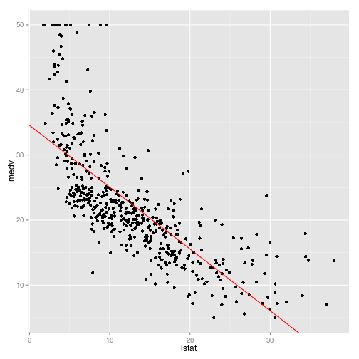
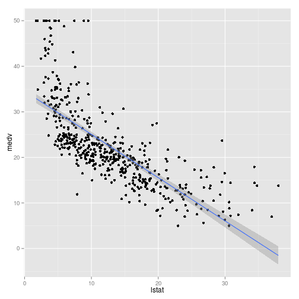
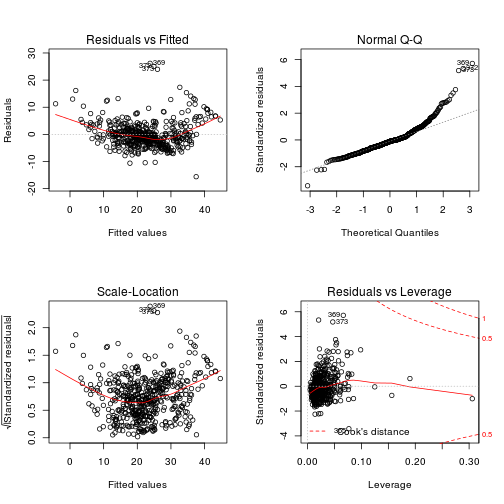
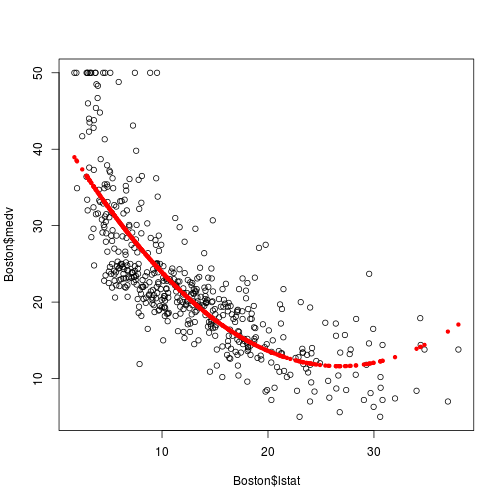
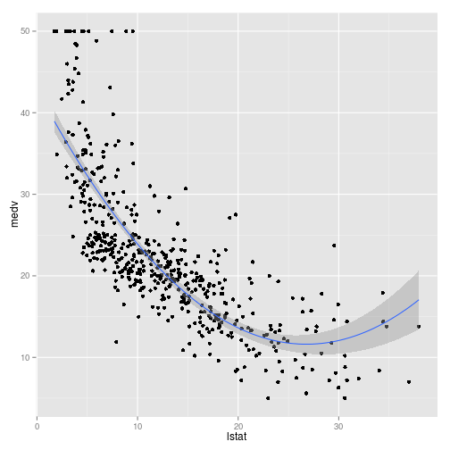
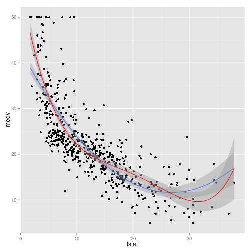

Introduction to Regression with the ISLR Library
========================================================

This is a file that is intended to be the first of a series of scripts associated with the [Introduction to Statistical Learning](http://online.stanford.edu/course/statistical-learning-winter-2014) offered online by [Stanford](http://online.stanford.edu/).  This covers their introduction to regression, but more importantly, it's an introduction to the statistical learning package they have developed called [ISLR](http://cran.r-project.org/web/packages/ISLR/index.html).

Why am I bothering to do this now?  I knew a priori that teasing out the impact of tax and expenditure limitations on fiscal and economic outcomes would be a sensitive business, and indeed, I have has analysis to date verify this.  To the extent that I want to capture the clearest signals I can, the [Elements of Statistical Learning](https://www.google.com/url?sa=t&rct=j&q=&esrc=s&source=web&cd=4&cad=rja&ved=0CE0QFjAD&url=http%3A%2F%2Fwww.stanford.edu%2F~hastie%2Flocal.ftp%2FSpringer%2FOLD%2FESLII_print4.pdf&ei=5C_kUtn3NMLisAS_tYHYCA&usg=AFQjCNGbK_GY8ymndHodqJ0PijBqvAYvyw&sig2=h2X28tDdJQTer750LHK4Rw&bvm=bv.59930103,d.cWc) text has been a treasure trove of ideas.  Furthermore, it simply discusses statistics in a manner that is more intuitive to me than any of my prior instruction.  The course walks through an applied version of this book, implemented in R.

This exercise begins with just three packages:


```r
library(MASS)
library(ggplot2)
library(ISLR)
```


We will begin with a dataset called Boston.  What variables are we using?


```r
names(Boston)
```

```
##  [1] "crim"    "zn"      "indus"   "chas"    "nox"     "rm"      "age"    
##  [8] "dis"     "rad"     "tax"     "ptratio" "black"   "lstat"   "medv"
```


Just to get a feel for things, let's look at median home value vs "lower" status population.


```r
# Regress medv on lstat
fit1 <- lm(medv ~ lstat, Boston)
summary(fit1)
```

```
## 
## Call:
## lm(formula = medv ~ lstat, data = Boston)
## 
## Residuals:
##    Min     1Q Median     3Q    Max 
## -15.17  -3.99  -1.32   2.03  24.50 
## 
## Coefficients:
##             Estimate Std. Error t value Pr(>|t|)    
## (Intercept)  34.5538     0.5626    61.4   <2e-16 ***
## lstat        -0.9500     0.0387   -24.5   <2e-16 ***
## ---
## Signif. codes:  0 '***' 0.001 '**' 0.01 '*' 0.05 '.' 0.1 ' ' 1
## 
## Residual standard error: 6.22 on 504 degrees of freedom
## Multiple R-squared:  0.544,	Adjusted R-squared:  0.543 
## F-statistic:  602 on 1 and 504 DF,  p-value: <2e-16
```

```r

# Add fit line to plot
ggplot(Boston, aes(lstat, medv)) + geom_point() + geom_abline(intercept = fit1$coef[1], 
    slope = fit1$coef[2], colour = "red")
```

 

```r

# stat_smooth is a bit more keystroke efficient
ggplot(Boston, aes(lstat, medv)) + geom_point() + stat_smooth(method = "lm")
```

 


Nothing crazy about that.  In the context of learning, prediction is of particular interest.  We can use our fitted model to predict the median home value associated with three new values of "lower" status (whatever that means).


```r
predict(fit1, data.frame(lstat = c(5, 10, 15)), interval = "confidence")
```

```
##     fit   lwr   upr
## 1 29.80 29.01 30.60
## 2 25.05 24.47 25.63
## 3 20.30 19.73 20.87
```


Let's get real crazy with some *multiple* regression.


```r
# Fit multiple regression model
fit2 <- lm(medv ~ lstat + age, Boston)
summary(fit2)
```

```
## 
## Call:
## lm(formula = medv ~ lstat + age, data = Boston)
## 
## Residuals:
##    Min     1Q Median     3Q    Max 
## -15.98  -3.98  -1.28   1.97  23.16 
## 
## Coefficients:
##             Estimate Std. Error t value Pr(>|t|)    
## (Intercept)  33.2228     0.7308   45.46   <2e-16 ***
## lstat        -1.0321     0.0482  -21.42   <2e-16 ***
## age           0.0345     0.0122    2.83   0.0049 ** 
## ---
## Signif. codes:  0 '***' 0.001 '**' 0.01 '*' 0.05 '.' 0.1 ' ' 1
## 
## Residual standard error: 6.17 on 503 degrees of freedom
## Multiple R-squared:  0.551,	Adjusted R-squared:  0.549 
## F-statistic:  309 on 2 and 503 DF,  p-value: <2e-16
```

```r

# Fit multiple regression with all other variables in the data.frame
fit3 <- lm(medv ~ ., Boston)
summary(fit3)
```

```
## 
## Call:
## lm(formula = medv ~ ., data = Boston)
## 
## Residuals:
##     Min      1Q  Median      3Q     Max 
## -15.594  -2.730  -0.518   1.777  26.199 
## 
## Coefficients:
##              Estimate Std. Error t value Pr(>|t|)    
## (Intercept)  3.65e+01   5.10e+00    7.14  3.3e-12 ***
## crim        -1.08e-01   3.29e-02   -3.29  0.00109 ** 
## zn           4.64e-02   1.37e-02    3.38  0.00078 ***
## indus        2.06e-02   6.15e-02    0.33  0.73829    
## chas         2.69e+00   8.62e-01    3.12  0.00193 ** 
## nox         -1.78e+01   3.82e+00   -4.65  4.2e-06 ***
## rm           3.81e+00   4.18e-01    9.12  < 2e-16 ***
## age          6.92e-04   1.32e-02    0.05  0.95823    
## dis         -1.48e+00   1.99e-01   -7.40  6.0e-13 ***
## rad          3.06e-01   6.63e-02    4.61  5.1e-06 ***
## tax         -1.23e-02   3.76e-03   -3.28  0.00111 ** 
## ptratio     -9.53e-01   1.31e-01   -7.28  1.3e-12 ***
## black        9.31e-03   2.69e-03    3.47  0.00057 ***
## lstat       -5.25e-01   5.07e-02  -10.35  < 2e-16 ***
## ---
## Signif. codes:  0 '***' 0.001 '**' 0.01 '*' 0.05 '.' 0.1 ' ' 1
## 
## Residual standard error: 4.75 on 492 degrees of freedom
## Multiple R-squared:  0.741,	Adjusted R-squared:  0.734 
## F-statistic:  108 on 13 and 492 DF,  p-value: <2e-16
```

```r

# Plot the four visual inspection plots associated with lm
par(mfrow = c(2, 2))
plot(fit3)
```

 

```r

# Get rid of some of the variables from fit3
fit4 <- update(fit3, ~. - age - indus)
summary(fit4)
```

```
## 
## Call:
## lm(formula = medv ~ crim + zn + chas + nox + rm + dis + rad + 
##     tax + ptratio + black + lstat, data = Boston)
## 
## Residuals:
##     Min      1Q  Median      3Q     Max 
## -15.598  -2.739  -0.505   1.727  26.237 
## 
## Coefficients:
##              Estimate Std. Error t value Pr(>|t|)    
## (Intercept)  36.34115    5.06749    7.17  2.7e-12 ***
## crim         -0.10841    0.03278   -3.31  0.00101 ** 
## zn            0.04584    0.01352    3.39  0.00075 ***
## chas          2.71872    0.85424    3.18  0.00155 ** 
## nox         -17.37602    3.53524   -4.92  1.2e-06 ***
## rm            3.80158    0.40632    9.36  < 2e-16 ***
## dis          -1.49271    0.18573   -8.04  6.8e-15 ***
## rad           0.29961    0.06340    4.73  3.0e-06 ***
## tax          -0.01178    0.00337   -3.49  0.00052 ***
## ptratio      -0.94652    0.12907   -7.33  9.2e-13 ***
## black         0.00929    0.00267    3.47  0.00056 ***
## lstat        -0.52255    0.04742  -11.02  < 2e-16 ***
## ---
## Signif. codes:  0 '***' 0.001 '**' 0.01 '*' 0.05 '.' 0.1 ' ' 1
## 
## Residual standard error: 4.74 on 494 degrees of freedom
## Multiple R-squared:  0.741,	Adjusted R-squared:  0.735 
## F-statistic:  128 on 11 and 494 DF,  p-value: <2e-16
```


Let's move on to interactions and non-linearities.  To start, let's see if `lstat` and `age` alter each other's impact on `medv`.


```r
# Fit interaction model
fit5 <- lm(medv ~ lstat * age, Boston)
summary(fit5)
```

```
## 
## Call:
## lm(formula = medv ~ lstat * age, data = Boston)
## 
## Residuals:
##    Min     1Q Median     3Q    Max 
## -15.81  -4.04  -1.33   2.08  27.55 
## 
## Coefficients:
##              Estimate Std. Error t value Pr(>|t|)    
## (Intercept) 36.088536   1.469835   24.55  < 2e-16 ***
## lstat       -1.392117   0.167456   -8.31  8.8e-16 ***
## age         -0.000721   0.019879   -0.04    0.971    
## lstat:age    0.004156   0.001852    2.24    0.025 *  
## ---
## Signif. codes:  0 '***' 0.001 '**' 0.01 '*' 0.05 '.' 0.1 ' ' 1
## 
## Residual standard error: 6.15 on 502 degrees of freedom
## Multiple R-squared:  0.556,	Adjusted R-squared:  0.553 
## F-statistic:  209 on 3 and 502 DF,  p-value: <2e-16
```


Note that we need only to explicitly include the interaction, but the base terms are still included.


```r
# Fit nonlinear model
fit6 <- lm(medv ~ lstat + I(lstat^2), Boston)
summary(fit6)
```

```
## 
## Call:
## lm(formula = medv ~ lstat + I(lstat^2), data = Boston)
## 
## Residuals:
##    Min     1Q Median     3Q    Max 
## -15.28  -3.83  -0.53   2.31  25.41 
## 
## Coefficients:
##             Estimate Std. Error t value Pr(>|t|)    
## (Intercept) 42.86201    0.87208    49.1   <2e-16 ***
## lstat       -2.33282    0.12380   -18.8   <2e-16 ***
## I(lstat^2)   0.04355    0.00375    11.6   <2e-16 ***
## ---
## Signif. codes:  0 '***' 0.001 '**' 0.01 '*' 0.05 '.' 0.1 ' ' 1
## 
## Residual standard error: 5.52 on 503 degrees of freedom
## Multiple R-squared:  0.641,	Adjusted R-squared:  0.639 
## F-statistic:  449 on 2 and 503 DF,  p-value: <2e-16
```


The `I()` term is used to ensure that the exponential reference does not mess up the formula language (it has its own meaning).  It stands for *Identity*.  The semi-colon enables us to put multiple commands in a single line.

We saw before that the linear fit line was not sufficient to explain the action in `medv`, but it does appear that a quadratic fit might.  We can use the model we just ran for this purpose.


```r
# Plot original data and add the fit line with base R
par(mfrow = c(1, 1))
plot(Boston$medv ~ Boston$lstat)
points(Boston$lstat, fitted(fit6), col = "red", pch = 20)
```

 

```r

# Do the same thing with ggplot2
ggplot(Boston, aes(lstat, medv)) + geom_point() + stat_smooth(method = "lm", 
    formula = y ~ poly(x, 2))
```

 


Note that we can add arbitrarily many overlay plots in R's base plotting system.  From here on out, however, we will opt for [ggplot2](http://ggplot2.org/).

The whole `I()` business is a little cumbersome, there is a quicker way to fit such a model.


```r
# Fit fourth power model
fit7 <- lm(medv ~ poly(lstat, 4), Boston)
summary(fit7)
```

```
## 
## Call:
## lm(formula = medv ~ poly(lstat, 4), data = Boston)
## 
## Residuals:
##     Min      1Q  Median      3Q     Max 
## -13.563  -3.180  -0.632   2.283  27.181 
## 
## Coefficients:
##                 Estimate Std. Error t value Pr(>|t|)    
## (Intercept)       22.533      0.235   95.99  < 2e-16 ***
## poly(lstat, 4)1 -152.460      5.280  -28.87  < 2e-16 ***
## poly(lstat, 4)2   64.227      5.280   12.16  < 2e-16 ***
## poly(lstat, 4)3  -27.051      5.280   -5.12  4.3e-07 ***
## poly(lstat, 4)4   25.452      5.280    4.82  1.9e-06 ***
## ---
## Signif. codes:  0 '***' 0.001 '**' 0.01 '*' 0.05 '.' 0.1 ' ' 1
## 
## Residual standard error: 5.28 on 501 degrees of freedom
## Multiple R-squared:  0.673,	Adjusted R-squared:  0.67 
## F-statistic:  258 on 4 and 501 DF,  p-value: <2e-16
```

```r

# Plot
ggplot(Boston, aes(lstat, medv)) + geom_point() + stat_smooth(method = "lm", 
    formula = y ~ poly(x, 2)) + stat_smooth(method = "lm", formula = y ~ poly(x, 
    4), color = "red")
```

 


How can we deal with categoricals?  We will use a new set called **Carseats** for this.  (By the way, if we want a quick and dirty data editor we can use `fix()`).

Let's fit a model with a couple interaction terms thrown into the mix.


```r
# Fit model
cfit1 <- lm(Sales ~ . + Income:Advertising + Age:Price, Carseats)
summary(cfit1)
```

```
## 
## Call:
## lm(formula = Sales ~ . + Income:Advertising + Age:Price, data = Carseats)
## 
## Residuals:
##    Min     1Q Median     3Q    Max 
## -2.921 -0.750  0.018  0.675  3.341 
## 
## Coefficients:
##                     Estimate Std. Error t value Pr(>|t|)    
## (Intercept)         6.575565   1.008747    6.52  2.2e-10 ***
## CompPrice           0.092937   0.004118   22.57  < 2e-16 ***
## Income              0.010894   0.002604    4.18  3.6e-05 ***
## Advertising         0.070246   0.022609    3.11  0.00203 ** 
## Population          0.000159   0.000368    0.43  0.66533    
## Price              -0.100806   0.007440  -13.55  < 2e-16 ***
## ShelveLocGood       4.848676   0.152838   31.72  < 2e-16 ***
## ShelveLocMedium     1.953262   0.125768   15.53  < 2e-16 ***
## Age                -0.057947   0.015951   -3.63  0.00032 ***
## Education          -0.020852   0.019613   -1.06  0.28836    
## UrbanYes            0.140160   0.112402    1.25  0.21317    
## USYes              -0.157557   0.148923   -1.06  0.29073    
## Income:Advertising  0.000751   0.000278    2.70  0.00729 ** 
## Price:Age           0.000107   0.000133    0.80  0.42381    
## ---
## Signif. codes:  0 '***' 0.001 '**' 0.01 '*' 0.05 '.' 0.1 ' ' 1
## 
## Residual standard error: 1.01 on 386 degrees of freedom
## Multiple R-squared:  0.876,	Adjusted R-squared:  0.872 
## F-statistic:  210 on 13 and 386 DF,  p-value: <2e-16
```

```r

# Reveal how R codes this categorical variable
contrasts(Carseats$ShelveLoc)
```

```
##        Good Medium
## Bad       0      0
## Good      1      0
## Medium    0      1
```


